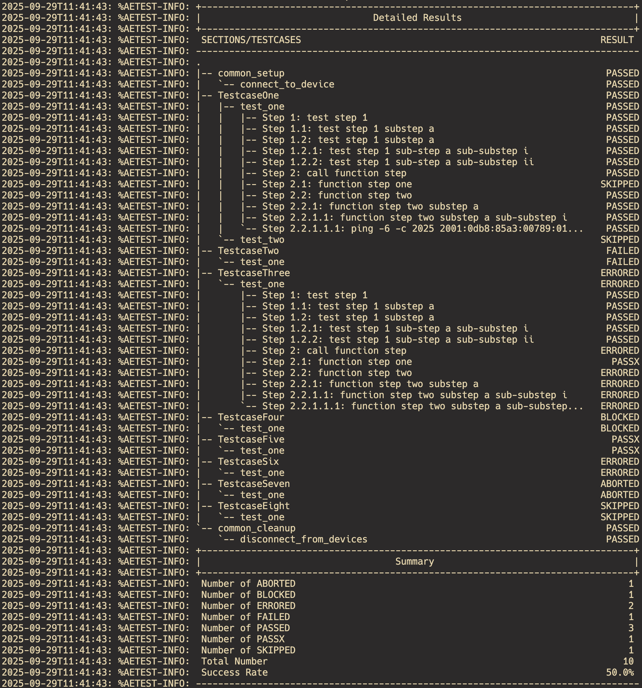
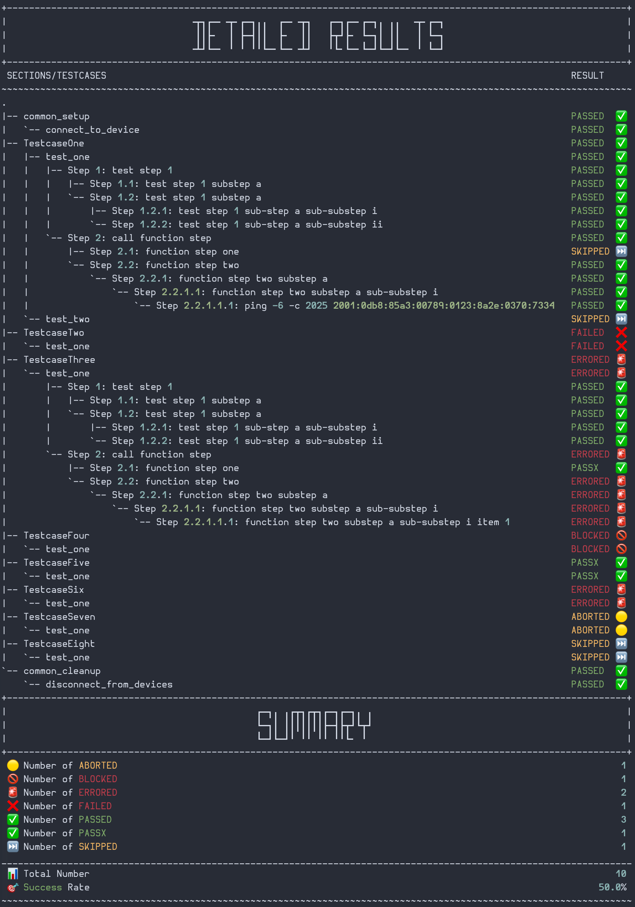

# pyATS Custom Standalone Reporter

Add **emojis** to the original pyATS **Standalone Reporter** to make large runs more scannable at a glance (without changing how you write tests).

- ✅ PASSED  ❌ FAILED  🚨 ERRORED  🟡 ABORTED  🚫 BLOCKED  ⏭️ SKIPPED
- Keeps the classic tree (`|--`, `` `-- ``) but aligns a **RESULT** column with emojis.
- Pure `aetest` integration... you only pass a custom reporter to `AEtest.main()`.

---

## Why

pyATS’ default standalone reporter is functional, but it’s easy to lose **scanability** on big outputs. This reporter keeps the same structure and simply **adds emojis** to improve quick visual parsing.

---

## Install

Place the module in your project (e.g. `pyats_custom_reporter.py`) or install from your repo/package.

---

## Quick Start

```python
from pyats import aetest
from pyats_custom_reporter import CustomReporter  # ← this package

def main():
    # AEtest Standalone Execution: pass your reporter
    aetest.main(__file__, reporter=CustomReporter())

if __name__ == "__main__":
    main()
````

That’s it. Your tests run as usual; the output shows the **Detailed Results** tree with emojis and a **Summary**.

---

## How it fits into AEtest

`aetest.main()` (Standalone Execution) accepts several parameters. The one we use here is:

- **`reporter`** (`BaseRootReporter`): pass an instance of your reporter.
  We pass `CustomReporter()` to replace the default `StandaloneReporter` presentation with emoji-augmented output.

> Full API for `AEtest.main()` and Standalone Execution is in the links below.

---

## Screenshots

- **Before** (default): `before.png`



- **After** (emoji reporter): `after.png`



---

## References (pyATS official docs)

- AEtest API: `AEtest.main()`
  [https://pubhub.devnetcloud.com/media/pyats/docs/apidoc/aetest/index.html#pyats.aetest.main.AEtest](https://pubhub.devnetcloud.com/media/pyats/docs/apidoc/aetest/index.html#pyats.aetest.main.AEtest)
- Default `StandaloneReporter`
  [https://pubhub.devnetcloud.com/media/pyats/docs/apidoc/aetest/pyats.aetest.reporter.html#pyats.aetest.reporter.default.StandaloneReporter](https://pubhub.devnetcloud.com/media/pyats/docs/apidoc/aetest/pyats.aetest.reporter.html#pyats.aetest.reporter.default.StandaloneReporter)
- Standalone Execution
  [https://pubhub.devnetcloud.com/media/pyats/docs/aetest/run.html#aetest-standalone-execution](https://pubhub.devnetcloud.com/media/pyats/docs/aetest/run.html#aetest-standalone-execution)
- AEtest Reports
  [https://pubhub.devnetcloud.com/media/pyats/docs/aetest/reports.html](https://pubhub.devnetcloud.com/media/pyats/docs/aetest/reports.html)
- AEtest Introduction
  [https://pubhub.devnetcloud.com/media/pyats/docs/aetest/introduction.html](https://pubhub.devnetcloud.com/media/pyats/docs/aetest/introduction.html)
- Steps & nesting
  [https://pubhub.devnetcloud.com/media/pyats/docs/aetest/steps.html#nesting-steps](https://pubhub.devnetcloud.com/media/pyats/docs/aetest/steps.html#nesting-steps)
- `TestResult` API
  [https://pubhub.devnetcloud.com/media/pyats/docs/apidoc/results/index.html#pyats.results.result.TestResult](https://pubhub.devnetcloud.com/media/pyats/docs/apidoc/results/index.html#pyats.results.result.TestResult)
- Test Result objects (source doc)
  [https://github.com/CiscoTestAutomation/pyats/blob/8f5882275e7f874b49a303ece792339a7b79f315/docs/results/objects.rst](https://github.com/CiscoTestAutomation/pyats/blob/8f5882275e7f874b49a303ece792339a7b79f315/docs/results/objects.rst)
- ASCII banner generator used for headings
  [https://patorjk.com/software/taag/#p=display&f=Future&t=Type+Something+&x=none&v=4&h=4&w=80&we=false](https://patorjk.com/software/taag/#p=display&f=Future&t=Type+Something+&x=none&v=4&h=4&w=80&we=false)

---
